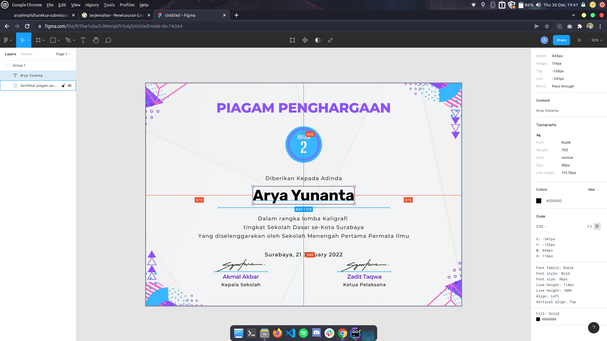
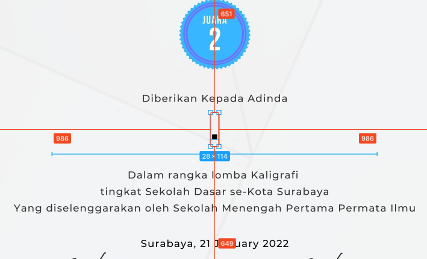

# Arthur


A program to generate certificates with the same appearance but with different data.

Thanks to [foggleman/gg](https://github.com/fogleman/gg) rendering 2D graphics library as manipulate images easier.

## Getting Started

1. Start with cloning this repository on your local machine :

```
$ git clone git@github.com:HMIF-UNSRI/arthur.git
$ cd arthur
```

2. Enter your csv file into the `arthur` folder with the name `data.csv`.
3. Enter your `font-face` and `background-image` in [assets](./assets) folder.
4. Configure the settings in the `app.config.json` file according to your needs.
5. Run the program in terminal

```
$ ./arthur
```

## Configure the `app.config.json` file

To get the center position of the image so that the position of the text matches what we want, we can use Figma.



Import your `background-image` on Figma, and adjust text like font, size, position in Figma. After that, turn the text
into a dot and adjust its position again so that it is in the middle. Select the text and press inspect then hover the
mouse over the area outside the text to see the margins.



After that you get the position, Position X is the left margin on the Figma, and Position Y the top margin on the Figma.
Likewise with the certificate code.

If you don't want to use the certificate code, you can delete the code field in the `app.config.json` file.

```json
{
  "config": {
    "event_name": "Web Development Series",
    "background_img": "./assets/bg-example.jpg",
    "name": {
      "font_path": "./assets/Rubik-Bold.ttf",
      "font_size": 96,
      "position_x": 986,
      "position_y": 700,
      "color_rgb": "0,0,0"
    }
  }
}
```